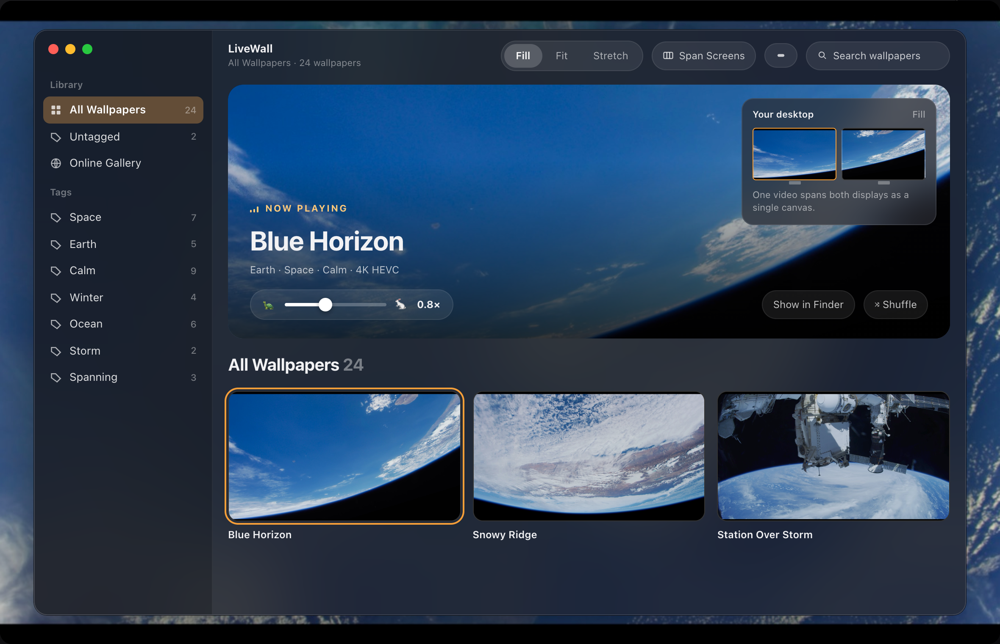
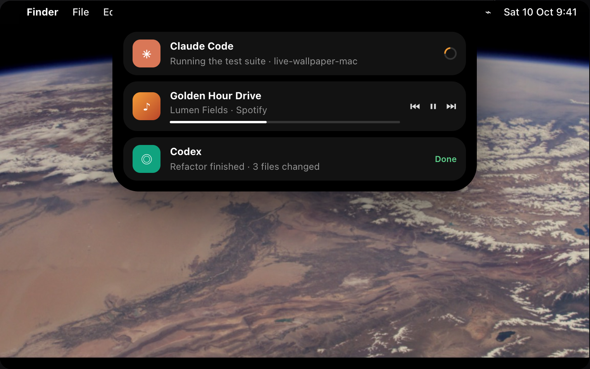
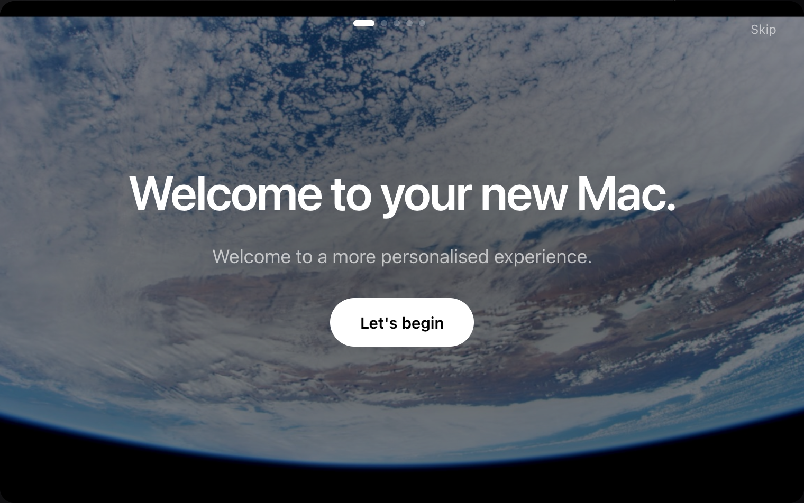
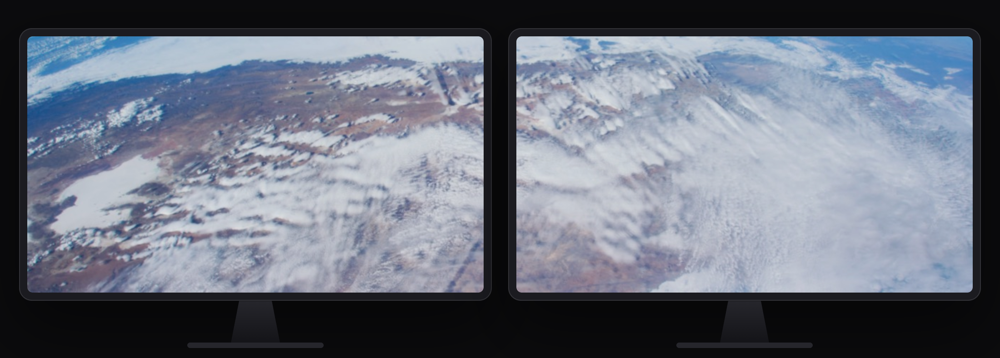
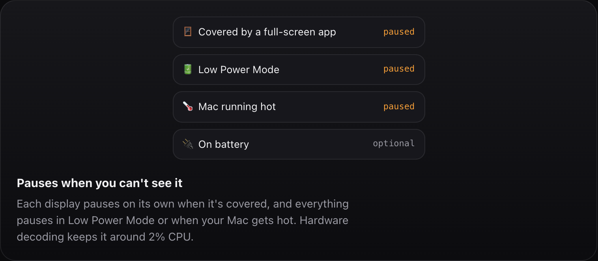
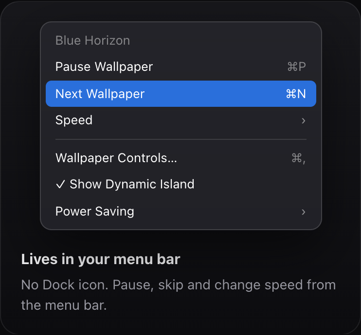
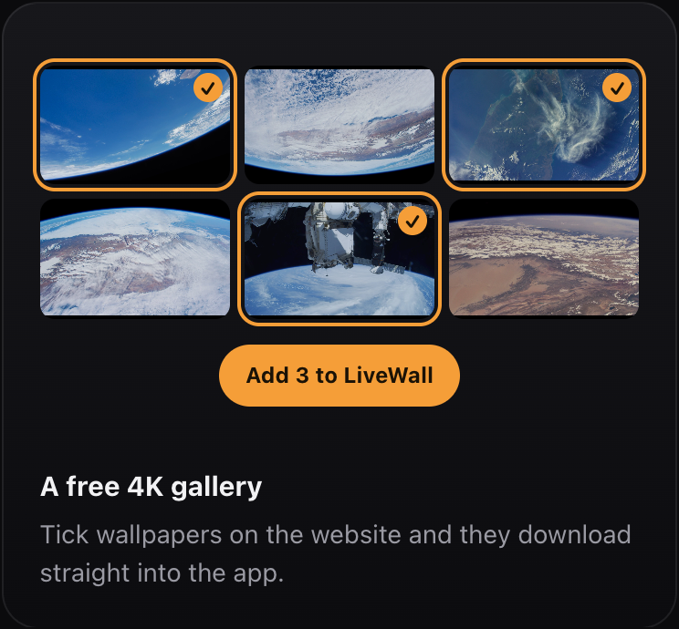
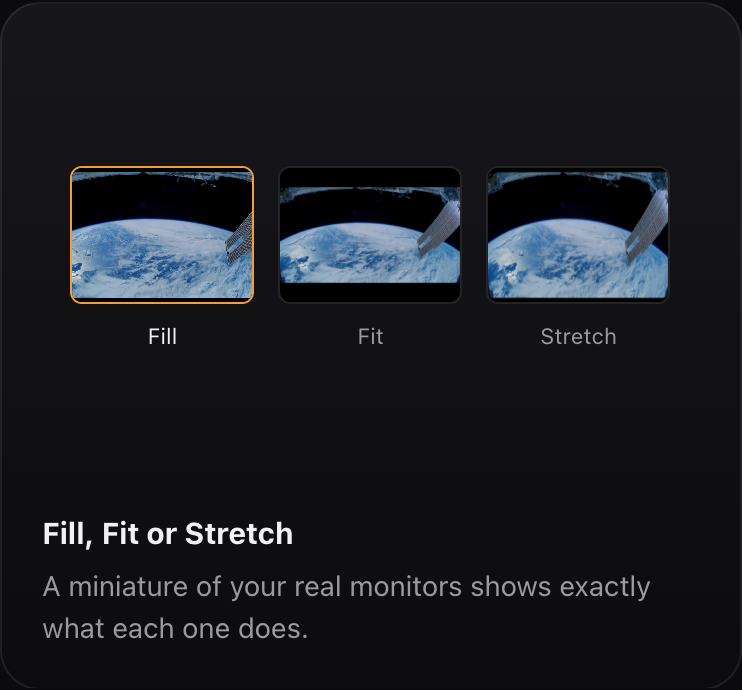

<p align="center">
  
</p>

<h1 align="center">LiveWall</h1>

<p align="center">
  <strong>Live video wallpapers for your Mac — with a Dynamic Island for music and AI activity.</strong><br>
  Looping 4K wallpapers behind your desktop icons, per-display wallpapers, power-aware playback,
  and a free online gallery you can add from in one click.
</p>

<p align="center">
  <a href="https://livewallpapermac.vercel.app/download"></a>
  
  
  
  <a href="https://livewallpapermac.vercel.app/gallery"></a>
</p>

<p align="center">
  <a href="https://livewallpapermac.vercel.app"><strong>See what it does →</strong></a>
</p>

## Screenshots

<p align="center">
  
</p>

<table>
  <tr>
    <td width="50%"></td>
    <td width="50%"></td>
  </tr>
  <tr>
    <td colspan="2"></td>
  </tr>
  <tr>
    <td></td>
    <td></td>
  </tr>
  <tr>
    <td></td>
    <td></td>
  </tr>
</table>

These are mockups of the real interface, drawn in HTML on the [home page](https://livewallpapermac.vercel.app) and exported with `python3 web/scripts/shoot_mockups.py`. The wallpapers are public-domain NASA footage.

## Contents

- [Features](#features)
- [LiveWall vs Wallpaper Engine](#livewall-vs-wallpaper-engine)
- [Requirements](#requirements)
- [Install](#install)
- [Quick start](#quick-start)
- [Using LiveWall](#using-livewall)
- [Settings reference](#settings-reference)
- [Supported formats](#supported-formats)
- [Recommended clips](#recommended-clips)
- [When LiveWall pauses](#when-livewall-pauses)
- [How it works](#how-it-works)
- [Privacy and permissions](#privacy-and-permissions)
- [Where your data lives](#where-your-data-lives)
- [Troubleshooting](#troubleshooting)
- [FAQ](#faq)
- [The online gallery](#the-online-gallery)
- [Build from source](#build-from-source)
- [Releasing](#releasing)
- [Roadmap](#roadmap)
- [License](#license)

## Features

**Wallpaper playback**
- Looping video wallpapers rendered at desktop level — behind your icons, click-through
- **Fill / Fit / Stretch** scaling, with a live miniature of your real monitor layout showing what each does
- **Per-video playback speed** (0.25×–1.5×), remembered for each wallpaper
- Changes **morph in place** and new videos **cross-fade** — no restart, no black flash

**Multiple displays**
- **Span** one continuous video across every display, or give **each display its own wallpaper**
- Displays showing the same video share one player, so they stay in sync and decode it once
- Per-display choices are remembered by display, and come back when you plug a monitor in again

**Library**
- Any folder of `.mp4` / `.mov` / `.m4v` files; new files appear immediately
- **Tags** with a sidebar filter, search, live hover previews
- **Remove wallpapers** with *Move to Trash* (right-click) — recoverable, and its tags, speed and display choices are cleaned up
- **Online Gallery** in the sidebar — download free 4K wallpapers straight into the library
- **Add from the website** — pick wallpapers on the gallery site and click *Add to LiveWall*

**Dynamic Island**
- A live-activity pill that grows out of the MacBook notch, or sits at the top edge of an external monitor
- Shows **Claude Code**, **ChatGPT / Codex** and **Claude app** activity, **music** from Spotify and Apple Music (with controls), and your wallpaper
- A public hook (`com.livewall.activity`) so any tool can post activity

**Power and performance**
- Pauses each display when it's covered, and everything in **Low Power Mode**, when the Mac is **hot**, and (optionally) **on battery**
- Hardware-decoded playback; about 2% CPU when idle

**Everything else**
- Menu-bar app (no Dock icon) with quick controls; **launch at login**
- Liquid Glass design (macOS 26) with a single "golden hour" amber accent

## LiveWall vs Wallpaper Engine

| | LiveWall | Wallpaper Engine |
|---|---|---|
| Platform | macOS 26+ (Apple silicon) | Windows |
| Price | Free | Paid |
| Video wallpapers | Yes | Yes |
| Per-display wallpapers | Yes | Yes |
| Pause on fullscreen / battery / heat | Yes | Yes |
| Dynamic Island (music, AI activity) | Yes | — |
| Add from a website in one click | Yes | Via Steam Workshop |
| Interactive / scene wallpapers | Not yet ([#15](https://github.com/01AHH/live-wallpaper-mac/issues/15)) | Yes |
| Playlists and rotation | Not yet ([#4](https://github.com/01AHH/live-wallpaper-mac/issues/4)) | Yes |

## Requirements

- **macOS 26 (Tahoe)** or later — the interface uses the Liquid Glass APIs
- An **Apple silicon** Mac (M1 or newer)
- To build from source: the Xcode Command Line Tools (Swift 6)
- To package releases: `create-dmg` (`brew install create-dmg`)
- To prepare gallery clips from WebM sources: `ffmpeg` (`brew install ffmpeg`)

## Install

1. Download LiveWall from **[livewallpapermac.vercel.app/download](https://livewallpapermac.vercel.app/download)** — the download starts automatically and the page walks you through the next steps.
2. Open it and drag **LiveWall** onto **Applications**.
3. Open LiveWall from Applications.

> LiveWall isn't signed with an Apple Developer ID yet, so macOS blocks the first launch. That's expected — see below.

### First launch

Opened straight from the `.dmg` or Downloads, LiveWall offers to **Move to Applications**, copies itself there, relaunches and ejects the installer. The first time it runs, a full-screen welcome — *"Welcome to your new Mac."* — walks you through choosing your first wallpaper (it plays behind the welcome as soon as you pick it), the Dynamic Island, and launch-at-login and power saving. Step through it with the **← →** arrow keys if you like. **Skip**, **Esc**, **⌘W** or **⌘Q** close it at any step, and if you switch to another app it steps back so it never covers your screen. Replay it any time from the menu bar (**Show Welcome…**).

### Gatekeeper

1. When macOS says it can't verify LiveWall, click **Done** (not *Move to Trash*).
2. Open **System Settings → Privacy & Security**, scroll to **Security**, and click **Open Anyway** next to *"LiveWall" was blocked*.
3. Confirm with your password or Touch ID. You only do this once per version.

Or, in Terminal: `xattr -dr com.apple.quarantine /Applications/LiveWall.app`

The full illustrated guide is at **[livewallpapermac.vercel.app/setup](https://livewallpapermac.vercel.app/setup)**.

### Updates

Download the new `.dmg`, quit LiveWall from its menu-bar icon, and replace the app in Applications. Your library, tags, speeds and settings are kept. You may need *Open Anyway* again, and to re-allow Accessibility if you use Claude app tracking.

## Quick start

1. Open LiveWall — its window appears, and its icon sits in the menu bar.
2. Choose **Online Gallery** in the sidebar and click **Get** on a wallpaper (or use *Add to LiveWall* on the website).
3. Click any wallpaper in your library to put it on the desktop.
4. Hover the Dynamic Island at the top of the screen to see what's playing.

## Using LiveWall

### The main window

| Area | What it does |
|---|---|
| Sidebar | *All Wallpapers*, *Untagged*, **Online Gallery**, and your tags (right-click a tag to rename or delete it) |
| Toolbar | Library folder, **Fill / Fit / Stretch**, **Span Screens**, the **Dynamic Island** menu, and search |
| Now Playing banner | The current wallpaper playing live, its tags, the **speed** slider, Show in Finder and **Shuffle** |
| *Your desktop* card | A miniature of your monitors showing exactly how the wallpaper will be laid out |
| Grid | Your library — click to use, hover to preview, right-click to tag, show in Finder or **Move to Trash** |

Closing the window doesn't quit LiveWall; reopen it from the menu-bar icon (**Wallpaper Controls…**).

### Getting wallpapers

- **Online Gallery** (sidebar): free 4K wallpapers; *Get* downloads one into your library with its tags.
- **Website**: tick wallpapers on [the gallery](https://livewallpapermac.vercel.app/gallery) and click **Add to LiveWall**. The browser opens LiveWall through a `livewall://add?ids=…` link and the wallpapers download with progress in the Dynamic Island.
- **Your own videos**: drop files into the library folder (`~/Movies/LiveWall` by default) or choose another folder with the toolbar's folder button.

### Removing wallpapers

Right-click a wallpaper → **Move to Trash…** (or, in the Online Gallery, **Remove from Library…**). After you confirm, the file goes to the Trash — restore it from there if you change your mind — and its tags, speed and per-display choices are removed. If it was playing, the next wallpaper in your library takes over.

### Multiple displays

- **Span Screens on**: one video stretches across all displays as a single canvas.
- **Span Screens off**: each display shows the full video. To give a display its own wallpaper, click that monitor in the *Your desktop* card (it gets an amber outline), then click a wallpaper. **All displays** goes back to choosing for every screen.

### Playback speed

The slider under the wallpaper's name runs from 0.25× to 1.5× in 0.05× steps and applies live; click the readout to reset to 1×. Each wallpaper remembers its own speed, and library previews play at it.

### Menu bar

The menu-bar icon shows the current wallpaper and why it's paused (if it is), plus **Pause/Resume** (P), **Next Wallpaper** (N), **Speed**, **Wallpaper Controls…** (,), **Show Welcome…**, **Show Dynamic Island**, **Power Saving**, **Launch at Login** and **Quit** (Q).

### Dynamic Island

Events (a new wallpaper, a finished AI task, a new song) spring it open for a few seconds; hover it to expand into cards with controls. Turn it off, or choose its sources, from the **Dynamic Island** button in the toolbar.

| Source | How it's tracked | Needs |
|---|---|---|
| Claude Code (terminal and the Claude app's Code tab) | Claude Code hooks → `livewall-claude-hook` | Hooks in `~/.claude/settings.json` |
| ChatGPT and Codex | Session logs in `~/.codex/sessions` | Nothing |
| Claude app chats | The app's Stop button, via Accessibility | Accessibility permission |
| Music (Spotify, Apple Music) | The apps' track-change notifications; controls via AppleScript | Automation permission, asked once |
| Your wallpaper | Built in | Nothing |

**Claude Code hooks** — add to `~/.claude/settings.json` (all `async`), using the scripts inside the app:

| Hook | Command |
|---|---|
| `UserPromptSubmit` | `/Applications/LiveWall.app/Contents/Resources/scripts/livewall-claude-hook prompt` |
| `Notification` | `…/livewall-claude-hook notify` |
| `PostToolUse` | `…/livewall-claude-hook resume` |
| `Stop` | `…/livewall-claude-hook stop` |

A copy-paste block is in the [setup guide](https://livewallpapermac.vercel.app/setup#claude-code).

**Your own tools** can post to the island:
```bash
/Applications/LiveWall.app/Contents/Resources/scripts/livewall-activity running "Rendering" --source "My Tool" --id render
/Applications/LiveWall.app/Contents/Resources/scripts/livewall-activity done "Rendered" --source "My Tool" --id render
```
States are `running`, `attention` and `done`; updates with the same `--id` replace each other.

## Settings reference

### Playback

| Option | Default | What it does |
|---|---|---|
| Fill / Fit / Stretch | Fill | Crop to cover the screen, show the whole frame with bars, or distort to fit exactly |
| Span Screens | On | One video across all displays, or one per display |
| Speed | 1× (per wallpaper) | 0.25×–1.5×, applied live |
| Per-display wallpaper | — | Set by clicking a monitor in the *Your desktop* card |

### Power saving (menu bar → Power Saving)

| Option | Default | What it does |
|---|---|---|
| Pause on Battery | Off | Pause while running on battery |
| Pause in Low Power Mode | On | Pause while Low Power Mode is on |
| Pause When Mac Is Hot | On | Pause at "serious" thermal pressure or above |

### Dynamic Island (toolbar → Dynamic Island)

| Option | Default | What it does |
|---|---|---|
| Show Dynamic Island | On | Show or hide the island entirely |
| Music | On | Spotify and Apple Music |
| Claude Code | On | Activity reported by the Claude Code hooks |
| ChatGPT & Codex | On | Turns from `~/.codex/sessions` |
| Claude app chats | Off | Needs Accessibility permission |

### General

| Option | Default | What it does |
|---|---|---|
| Library folder | `~/Movies/LiveWall` | Where wallpapers live (toolbar folder button) |
| Launch at Login | On (set on first run) | Start LiveWall when you log in |

## Supported formats

| Format | Support |
|---|---|
| `.mp4`, `.mov`, `.m4v` with H.264 or HEVC | Played directly, hardware-decoded |
| Videos with audio | Played muted |
| WebM, VP9, AV1 | Not played — convert to HEVC first (e.g. with ffmpeg) |
| GIFs, images, web pages | Not yet ([#15](https://github.com/01AHH/live-wallpaper-mac/issues/15)) |

## Recommended clips

- **HEVC (H.265)** at your display's resolution — the cheapest to decode
- **Seamless loops** — a visible jump at the loop point is distracting
- Calm motion and no burned-in text or logos
- **60 fps** if you'll slow it down — 30 fps at 0.5× looks steppy

## When LiveWall pauses

- A display's wallpaper is hidden — a fullscreen app's Space, or windows covering it (each display pauses on its own)
- The displays are asleep
- **Low Power Mode** is on (default)
- The Mac is running **hot** (default)
- On **battery** (if you turn it on)
- You chose **Pause** in the menu bar or the Dynamic Island

The menu-bar menu's first line says why it's paused. Automatic pauses never pop up the Dynamic Island.

## How it works

```
┌──────────────────────────────────────────────┐
│ Dynamic Island        NSPanel above the menu │  click-through except over the island
├──────────────────────────────────────────────┤
│ Your windows                                 │
├──────────────────────────────────────────────┤
│ Desktop icons                    (Finder)    │
├──────────────────────────────────────────────┤
│ LiveWall wallpaper windows   desktop level   │  one borderless window per display,
│   AVPlayerLayer ← channel (one player/video) │  each showing an AVPlayerLayer
└──────────────────────────────────────────────┘
```

- `WallpaperController` — the desktop windows, one *channel* (`AVQueuePlayer` + `AVPlayerLooper`) per distinct video, cross-fades, per-display pause from window occlusion
- `PowerMonitor` — AC vs battery (IOKit), Low Power Mode, thermal state
- `ControlPanel`, `LibraryTile`, `OnlineGallery` — the SwiftUI window, library grid and gallery
- `DynamicIsland`, `Activities`, `AIWatchers` — the island, music and activity sources
- `AppSettings`, `CategoryStore` — persisted settings and `categories.json` tags

## Privacy and permissions

- LiveWall plays files from your disk; nothing about your library leaves your Mac.
- The online gallery and stats are contacted only when you open the Online Gallery or download from it.
- Gallery votes and download counts are keyed by a **salted hash of your IP address** — the address itself is never stored.

| Permission | Why | When it's asked |
|---|---|---|
| Accessibility | Spot the Stop button in the Claude/ChatGPT apps (never reads messages) | Only if you turn on *Claude app chats* |
| Automation (Spotify, Music) | Play/pause and skip from the island | The first time you press a music control |
| Login item | Launch at login | Added on first run; macOS shows a notification |

## Where your data lives

```
~/Movies/LiveWall/                         your wallpapers (or the folder you chose)
└── categories.json                        tags
~/Library/Preferences/com.arthurhinton.LiveWall.plist   settings, speeds, per-display choices
/Applications/LiveWall.app/Contents/Resources/scripts/   livewall-activity, livewall-claude-hook
```

To reset LiveWall's settings: quit it, then run `defaults delete com.arthurhinton.LiveWall`.

## Troubleshooting

**"LiveWall is damaged and can't be opened."**
Run `xattr -dr com.apple.quarantine /Applications/LiveWall.app` and open it again.

**There's no "Open Anyway" button.**
It only appears for about an hour after a blocked launch. Open LiveWall again, click Done, then go straight to Privacy & Security.

**"Add to LiveWall" on the website does nothing.**
LiveWall must be in Applications and opened once before the browser knows about it.

**I can't see LiveWall in the menu bar.**
If your menu bar is full, macOS hides icons behind the notch. Hold ⌘ and drag other icons out to make room, and check LiveWall is allowed in System Settings → Menu Bar. Opening LiveWall again from Applications always brings up its window.

**The desktop is black or not moving.**
Check the first line of the menu-bar menu — it says why playback is paused.

**I can't see the Dynamic Island.**
On an external monitor it hides when nothing's happening; move the pointer to the top-centre edge. Check *Show Dynamic Island* is ticked.

**Claude app chats don't show.**
Turn on *Claude app chats* and allow LiveWall in Privacy & Security → Accessibility (again after each update).

## FAQ

**Does LiveWall use much battery?**
Video is hardware-decoded and LiveWall idles at around 2% CPU; it pauses in Low Power Mode, when hot, when covered, and optionally on battery.

**Can I use my own videos?**
Yes — any `.mp4`, `.mov` or `.m4v` in the library folder.

**Does it work on Intel Macs or older macOS?**
Not currently: it needs macOS 26 and Apple silicon.

**Can it show a live wallpaper on the lock screen?**
Not yet — there's no public API for it. It's on the roadmap ([#7](https://github.com/01AHH/live-wallpaper-mac/issues/7)).

**Why do some gallery wallpapers say "Licence unverified"?**
Their source and licence haven't been checked; you may need a licence from the creator to use or share them.

## The online gallery

**[livewallpapermac.vercel.app](https://livewallpapermac.vercel.app)** — a static site in [`web/`](web) on Vercel: the home page with the app's features (`index.html`), the gallery at [`/gallery`](https://livewallpapermac.vercel.app/gallery), `/download` and `/setup`. Clean URLs are on in `web/vercel.json`, so old `.html` links and `/features` redirect. Videos live in the Cloudflare R2 bucket `livewall-media` and votes/downloads from a Cloudflare Worker + D1 in [`web/stats/`](web/stats). Each wallpaper has a ♥ vote and a download count, and the grid can be sorted by *Most downloaded* or *Most loved*.

Licensing: openly licensed entries (public domain, CC0, CC BY, own work) are credited to their source. Entries imported from a local library are published with `"unverified": true` and shown with a **Licence unverified** flag; `publish.mjs` refuses any other entry without an allowed licence, credit and source.

To deploy the website: `scripts/deploy-web.sh` (needs `npx vercel login` once). Pushing to GitHub doesn't deploy it.

To refresh the README screenshots after changing the home page's mockups: `python3 web/scripts/shoot_mockups.py` (needs Python Playwright and Chrome).

To add wallpapers:
1. **From longer footage** — `swift web/scripts/clip.swift <url> <start> <seconds> web/content <id>` cuts a 4K HEVC clip, a preview and a poster. Vetted candidates are in [`web/candidates.json`](web/candidates.json).
2. **From a LiveWall library** — `python3 web/scripts/import_local.py --library Media --tag Japan` (or `--name 'lo-?fi' --label Lofi`).
3. Run `npm run publish-catalog` in `web/` (uploads to R2, skipping files already there), then commit `web/public/catalog.json`.

Stats Worker: `npx wrangler deploy` in `web/stats/`; schema in `schema.sql`.

## Build from source

1. Install the Xcode Command Line Tools: `xcode-select --install`
2. Clone and build:
   ```bash
   git clone https://github.com/01AHH/live-wallpaper-mac.git
   cd live-wallpaper-mac
   swift build -c release
   ./.build/release/LiveWall          # runs without launch at login or livewall:// links
   scripts/release.sh 3.0 --install   # builds the full app bundle into /Applications
   ```

### Project layout

```
Sources/LiveWall/        the app (Swift, AppKit + SwiftUI)
Packaging/               Info.plist template, DMG background generator
scripts/                 release.sh, deploy-web.sh, livewall-activity, livewall-claude-hook
web/public/              the website: home (features), gallery, download and setup pages
web/scripts/             clip.swift, import_local.py, publish.mjs, shoot_mockups.py
web/stats/               votes/downloads Worker (Cloudflare D1)
Media/                   the author's local wallpaper library
docs/                    icon, screenshots (docs/screenshots/ is generated) and BRAND.md, the look everything follows
```

## Releasing

1. `scripts/release.sh <version> --publish`
   - builds the app, bundles the helper scripts and ad-hoc signs it;
   - makes a styled `.dmg` with `create-dmg`: the app and Applications on a black stage with the amber glow, and the install steps (`Packaging/make_dmg_background.swift`);
   - uploads `releases/LiveWall-<version>.dmg`, `releases/LiveWall.dmg` and `releases/latest.json` to R2.
2. The website's download page (`web/public/download.html`, served at `/download`) reads `latest.json` for the version, size and link — no redeploy needed. It starts the download on Apple silicon Macs and explains the requirements to everyone else; add `?preview` to view it without downloading.

Uploading needs `npx wrangler login` once (Cloudflare account with R2).

## Roadmap

Prioritised from a review of Wallpaper Engine, Lively, Backdrop, Wallper, Wallux/Wallspace, Phosphene, Aerial and Plash; each item is a [GitHub issue](https://github.com/01AHH/live-wallpaper-mac/issues).

**Done** — pause when hidden (per display); per-video speed; Dynamic Island; launch at login (#14); battery / Low Power Mode (#1); thermal awareness (#2); menu-bar controls (#5); per-display wallpapers (#3); downloadable app and online gallery with votes.

**Next**
- [ ] Playlists and rotation ([#4](https://github.com/01AHH/live-wallpaper-mac/issues/4))
- [ ] Sync a still frame to the system wallpaper ([#6](https://github.com/01AHH/live-wallpaper-mac/issues/6))
- [ ] Live video on the lock and login screens, experimental ([#7](https://github.com/01AHH/live-wallpaper-mac/issues/7))
- [ ] Per-app rules, including camera in use ([#8](https://github.com/01AHH/live-wallpaper-mac/issues/8))
- [ ] Lower-resolution variants on battery ([#9](https://github.com/01AHH/live-wallpaper-mac/issues/9))
- [ ] Shortcuts actions and global hotkeys ([#10](https://github.com/01AHH/live-wallpaper-mac/issues/10))
- [ ] Schedules: time of day, sunrise/sunset, light/dark ([#11](https://github.com/01AHH/live-wallpaper-mac/issues/11))
- [ ] Import tool: convert to HEVC, trim, smooth the loop seam ([#12](https://github.com/01AHH/live-wallpaper-mac/issues/12))
- [ ] Smooth motion for slowed-down videos ([#13](https://github.com/01AHH/live-wallpaper-mac/issues/13))
- [ ] Interactive web/HTML scenes ([#15](https://github.com/01AHH/live-wallpaper-mac/issues/15)) and other nice-to-haves ([#16](https://github.com/01AHH/live-wallpaper-mac/issues/16))

**Housekeeping**
- [ ] Apple Developer ID signing and notarization (removes *Open Anyway*, keeps permissions across updates)
- [ ] Automatic updates (Sparkle) reading `releases/latest.json`; a universal (Intel) build
- [ ] Cut and publish the 37 vetted clips in `web/candidates.json`; decide on the 8 CC BY-SA candidates
- [ ] Custom domain for R2 (the `r2.dev` address is rate-limited); delete the 7 old copies in Vercel Blob
- [ ] Confirm Claude/ChatGPT app chat detection on real windows

## License

LiveWall's code is released under the [MIT License](LICENSE). Wallpapers in the online gallery are not covered by it: each carries its own licence, shown with it.

---

© 2026 Arthur Hinton
