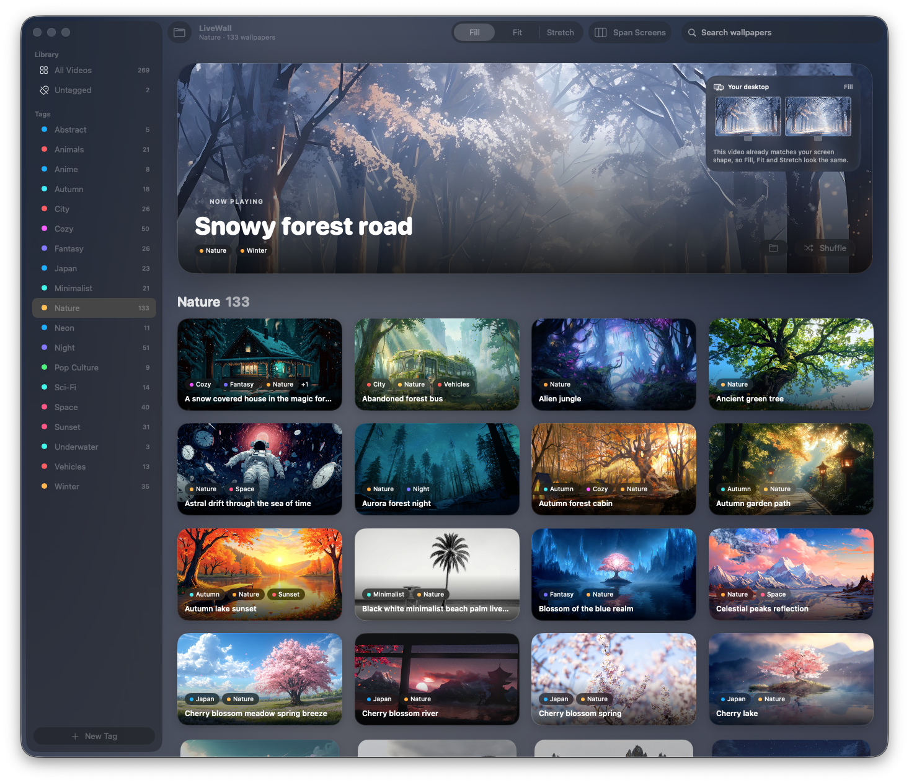

# LiveWall — Live Wallpaper for Mac

A lightweight live/video wallpaper app for macOS, built in Swift + AppKit/SwiftUI.
Plays looping muted videos behind your desktop icons, with a Wallpaper-Engine-style
control panel.



## Features
- Looping **video wallpapers** rendered at desktop window level (behind icons, click-through)
- **Multi-monitor**: span one continuous video across all screens, or play per-screen
- **Fill / Fit / Stretch** scaling (crop-to-fill, letterbox, or distort to fit)
- Setting changes **morph in place** and new videos **cross-fade** — no restart or black flash
- Liquid Glass **control panel** (macOS 26) with a live "Now Playing" hero, a miniature
  of your real monitor layout previewing the current scaling, and search
- **Per-video playback speed** (0.25×–1.5×), remembered for each wallpaper and
  applied live; library previews play at the same pace
- Calm, consistent "golden hour" brand: one amber accent for what's playing,
  selected or primary; clean artwork tiles in the style of Apple's media apps
- Hover-only motion: 3D tilt with a cursor-following highlight and live video
  previews, paused while scrolling so the library scrolls smoothly; an ambient
  background tinted from the current wallpaper (respects Reduce Motion)
- **Tags / categories**: a sidebar filters the library by tag; right-click any video to
  tag it (multiple tags per video). Tags live in `categories.json` beside the videos
- Menu-bar app (no Dock icon); settings persist across launches

## Requirements
macOS 26 (Tahoe) or later — the UI uses the Liquid Glass APIs.

## Build & run
```bash
swift build -c release
./.build/release/LiveWall
```

## Wallpaper library
By default the app looks in `~/Movies/LiveWall`. Drop `.mp4`, `.mov`, or `.m4v`
files there, or choose any folder from the control panel.

Tags are stored in `<library>/categories.json`:
```json
{ "version": 1,
  "tags": ["Cozy", "Nature"],
  "videos": { "autumn-forest-cabin.mp4": ["Cozy", "Nature"] } }
```
Edit it by hand or regenerate it — the app picks up external changes live.

## Packaging
The icon is generated by `make_icon.swift`; the `.app` bundle is assembled from
the release binary plus `AppIcon.icns` and `Contents/Info.plist`.

## Roadmap
- [ ] Launch at login (`SMAppService`)
- [x] Pause rendering when a fullscreen app covers the desktop (also when windows cover every screen, or displays sleep)
- [ ] Interactive **web/HTML scenes** via `WKWebView`
